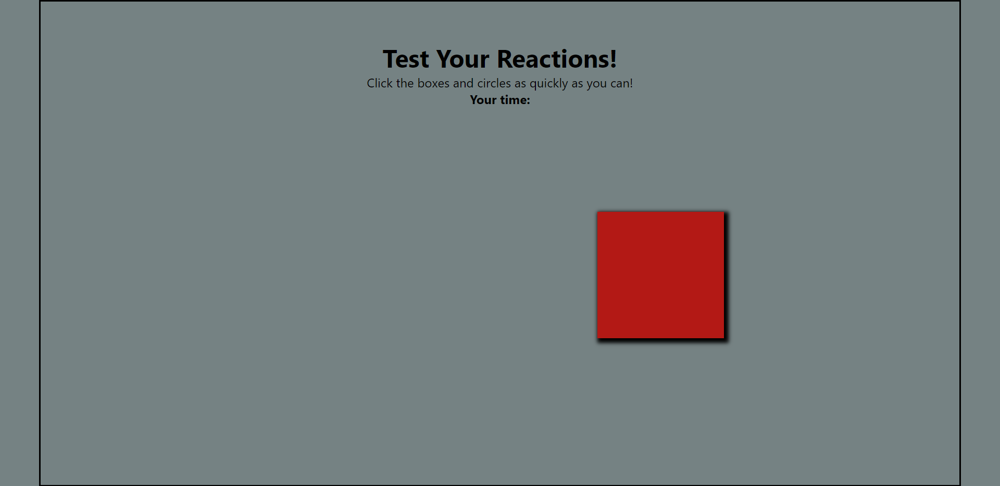

# ReactionTimer JavaScript_Project

> ### **Deployed Website** :-[Live Link](https://reactiontimer-jsp.netlify.app/)
 

## Project key takeaways:

  - Used Only **JavaScript**, **Html** and **CSS** for this project.
  - Created a random hex color code function for the shapes' color.
  - Used DOM and Math.random() to create different shapes.
  - Used setTimeout to make the shapes appear after a delay.
 - Used Get Date Methods to calculate the reaction time.

   

 
